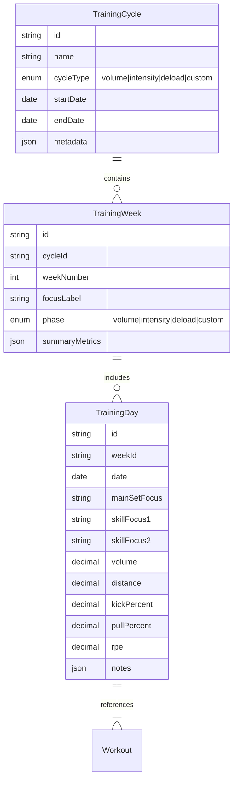

# Vorschlag: Wochenplanung & Zyklisierung

## Hintergrund & Zielsetzung
Die aktuelle Anwendung unterstützt bereits die Planung einzelner Trainingseinheiten, jedoch fehlt eine integrierte Wochenperspektive. Der Excel-Plan dient als Inspiration: Er zeigt Trainingseinheiten in Blöcken, die einem wöchentlichen Rhythmus folgen und unterschiedliche Schwerpunkte (z. B. Volumenphase, Fokusbereiche, Skill-Schwerpunkte) hervorheben. Ziel ist es, eine Funktion zu entwickeln, die es Trainer:innen erlaubt, Wochenpläne mit klaren Zyklen und Prioritäten zu erstellen, diese automatisch mit den Athlet:innen zu teilen und Fortschritte auszuwerten.

## Kernanforderungen
- **Wochenansicht mit Zyklen:** Darstellung von mindestens vier aufeinanderfolgenden Wochen mit visuell differenzierten Phasen (z. B. Volumen, Intensität, Deload).
- **Mehrdimensionale Fokussierung:** Pro Tag sollen Fokusbereiche (z. B. Main Set Focus, Skill Focus #1/#2) erfasst und angezeigt werden können.
- **Parameter pro Einheit:** Jede Zeile muss pro Tag Angaben zu Volumen, Distanz, Kick, Pull und RPE zulassen; Werte sollen summiert und pro Woche ausgewertet werden können.
- **Vorlagen & Wiederverwendung:** Trainer:innen definieren Zyklusvorlagen (z. B. 3 Wochen Belastung + 1 Woche Deload), die schnell auf neue Zeiträume angewendet werden können.
- **Synchronisation mit bestehenden Trainingsdaten:** Einzelne Workouts aus der Tagesplanung lassen sich in die Wochenübersicht verlinken, sodass Änderungen an Workouts automatisch in der Wochenmatrix reflektiert werden.
- **Team- und Athlet:innen-Zuweisung:** Wochenpläne können bestimmten Athlet:innen oder Gruppen zugewiesen werden; Freigaben und Feedback-Schleifen werden unterstützt.
- **Analyse & Reporting:** Visualisierung aggregierter Trainingslast pro Woche/Zyklus, Export als PDF/CSV.

## Nutzerfluss
1. Trainer:in wählt im Wochenplan-Modul eine Vorlage oder erstellt eine neue Woche.
2. Pro Woche werden Fokusphase, Tagesfoki und Parameter eingegeben. Schnellaktionen ermöglichen das Kopieren von Tagen/Wochen.
3. Die App synchronisiert verbundene Workouts und validiert, dass Workload-Ziele eingehalten werden.
4. Nach Freigabe sehen Athlet:innen ihren Wochenplan in der App, geben Feedback (RPE, Anmerkungen) und können Abweichungen markieren.
5. Dashboard zeigt Training Load pro Woche, Trendlinien und Einhaltung der geplanten Zyklen.

## UI-/UX-Skizze
- **Kalenderähnliche Tabellenansicht:** Zeilen = Tage (Mo–So), Spalten = Fokusbereiche und Kennzahlen. Farbige Hervorhebung je nach Phase (z. B. Grün = Volumen, Gelb = Intensität, Blau = Deload).
- **Spaltenkonfiguration:** Anwender:innen können Spalten aktivieren/deaktivieren (z. B. weitere Skill-Foci) und Reihenfolge anpassen.
- **Tooltip & Drill-Down:** Klick auf einen Tagesblock öffnet ein Modal mit verknüpften Workouts, detaillierten Notizen und Möglichkeit zur Anpassung.
- **Zusammenfassungszeile:** Unter jeder Woche werden automatisch Summen/Durchschnittswerte (Volumen, RPE, Kick/Pull-Anteile) angezeigt.

## Datenmodell-Erweiterungen


- **Vorlagen:** Zusätzliche Tabellen `CycleTemplate`, `WeekTemplate`, `DayTemplate` zum Speichern wiederverwendbarer Konfigurationen.
- **Aggregation:** Wöchentliche Metriken werden über Trigger oder geplante Jobs aggregiert (z. B. Summen von Volume, Durchschnitt RPE).

## API-Änderungen (REST/GraphQL-Beispiel)
- `GET /cycles` – Liste aller Zyklen, optional gefiltert nach Team/Athlet:in.
- `POST /cycles` – Neuen Zyklus anlegen inkl. Wochenstruktur.
- `PATCH /cycles/{id}` – Zyklusphase ändern, Wochen hinzufügen.
- `GET /cycles/{id}/weeks` – Wochenübersicht mit Fokusdaten.
- `POST /weeks/{id}/days` – Tagesdetails aktualisieren.
- `POST /cycles/{id}/publish` – Plan für ausgewählte Athlet:innen freigeben.

GraphQL-Schema (Auszug):
```graphql
type TrainingCycle {
  id: ID!
  name: String!
  cycleType: CycleType!
  startDate: Date!
  endDate: Date!
  weeks: [TrainingWeek!]!
}

type TrainingWeek {
  id: ID!
  weekNumber: Int!
  focusLabel: String
  phase: Phase!
  days: [TrainingDay!]!
  summary: WeekSummary!
}
```

## Integrationen & Automatisierung
- **Kalender-Sync:** Export einzelner Wochen zu iCal/Google Calendar.
- **Notifications:** Push-Benachrichtigungen, wenn ein neuer Wochenplan verfügbar ist oder Abweichungen auftreten.
- **Feedback-Schleife:** Automatisierte Erinnerung an Athlet:innen, RPE nach der Einheit zu loggen; Trainer:innen erhalten Abweichungsberichte.

## Technische Umsetzungsschritte
1. **Backend:** Einführung der neuen Cycle- und Week-Entities, Migrationen, CRUD-Endpoints, Aggregationslogik.
2. **Frontend:** Neues Modul „Wochenplanung“ mit Tabellen-UI, Drag-&-Drop für Wochen/Tage, Inline-Editing.
3. **Vorlagen-System:** UI zum Erstellen/Verwalten von Vorlagen, Logik zum Anwenden auf neue Zyklen.
4. **Reporting:** Charts für Trainingslast (z. B. Balken je Woche, Linien für RPE), Exportfunktionen.
5. **Tests & QA:** Unit-Tests für Berechnungen, E2E-Tests für die Erstellung und Freigabe eines Plans.
6. **Rollout:** Beta mit ausgewählten Trainer:innen, Feedback sammeln, Iterationen.

## Erwarteter Nutzen
- Strukturiertere Planung ermöglicht bessere Belastungssteuerung und reduziert Verletzungsrisiken.
- Trainer:innen sparen Zeit durch Vorlagen und Automatisierung.
- Athlet:innen erhalten transparente Wochenübersichten und können Feedback fokussiert geben.
- Datenbasis für langfristige Analysen (z. B. Vergleich von Zyklen, Identifikation erfolgreicher Muster).

## Offene Fragen
- Wie granular sollen die Skill-Foci sein? Freitext vs. vordefinierte Kategorien.
- Benötigen wir mehr als zwei Skill-Spalten? Konfigurierbar?
- Soll die Wochenansicht auch auf mobilen Geräten funktionieren oder nur Desktop?
- Welche KPIs sind für Trainer:innen besonders relevant (z. B. CTL/ATL/TSB)?

## Nächste Schritte
1. Anforderungen verfeinern (Workshops mit Trainer:innen).
2. Klickdummy/Prototyp in Figma erstellen.
3. Aufwandsschätzung und Sprintplanung.
4. MVP umsetzen (Grundfunktionen, einfache Vorlagen, Summen pro Woche).
5. Feedback einholen, iterativ erweitern.
